# DevPortfolio — Proyecto Integrador
### Programación y Plataformas Web | Universidad Politécnica Salesiana


**URL de la aplicación:** https://ppw-integrador.web.app  
**Repositorio Angular:** https://github.com/Emanuelleon19/icc-ppw-integrador  
**Repositorio Strapi:** https://github.com/Emanuelleon19/icc-ppw-strapi  

---

##  Integrantes

| Nombre | Rol | GitHub |
|---|---|---|
| Emanuel Leon | Desarrollador Full Stack | [@Emanuelleon19](https://github.com/Emanuelleon19) |
| Sebastian Zurita | Desarrollador Frontend | [@TZsebastian](https://github.com/TZsebastian) |

---

##  Descripción del Proyecto

Aplicación web tipo portafolio profesional multiusuario desarrollada con Angular 21, Firebase y Strapi CMS. Permite presentar los perfiles de los programadores, mostrar proyectos destacados y gestionar solicitudes de contacto de usuarios externos autenticados.

---

##  Arquitectura del Sistema

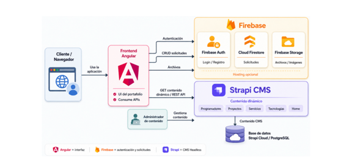

### Separación de responsabilidades

| Capa | Tecnología | Responsabilidad |
|---|---|---|
| Frontend | Angular 21 | Interfaz de usuario, consumo de APIs, routing |
| Autenticación | Firebase Auth | Registro e inicio de sesión de usuarios |
| Base de datos | Cloud Firestore | Almacenamiento de solicitudes de contacto |
| CMS | Strapi Cloud | Administración de contenido dinámico |
| Hosting | Firebase Hosting | Despliegue del frontend |

---

##  Funcionalidades Implementadas

### Home-Page (sin autenticación)
- Página Home con hero, equipo, servicios y proyectos destacados
- Perfil individual de cada programador con sus proyectos
- Navegación responsive con menú hamburguesa en móvil

### Usuario externo autenticado
- Registro e inicio de sesión con correo y contraseña
- Envío de solicitudes de contacto a programadores
- Vista de sus solicitudes enviadas con estado

### Programador autenticado
- Vista de solicitudes recibidas
- Respuesta y cambio de estado de solicitudes
- Diferenciación visual en navbar

---

##  Capturas de Pantalla

### Página Home
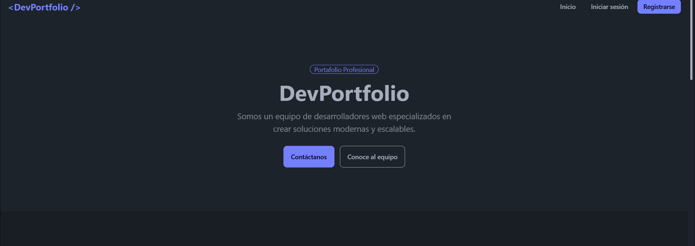

### Perfil del Programador
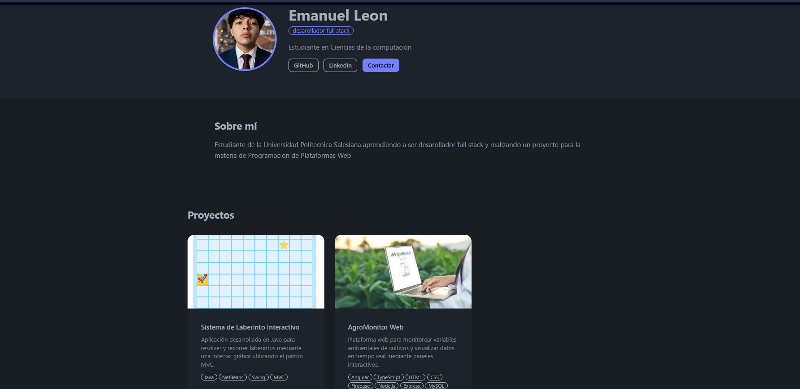

### Formulario de Solicitud
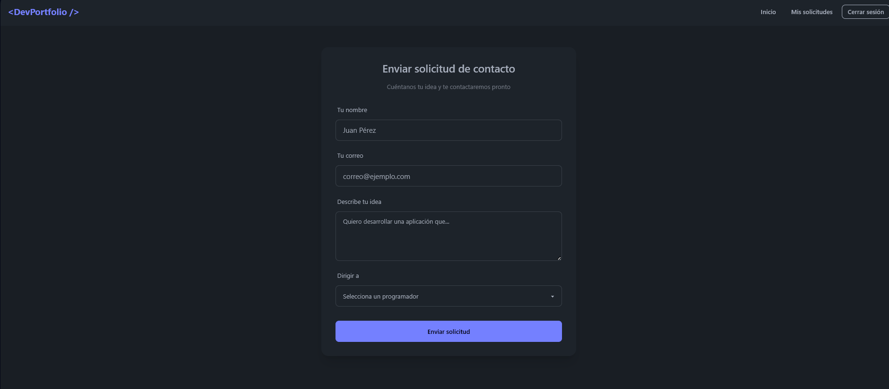


### Dashboard Usuario
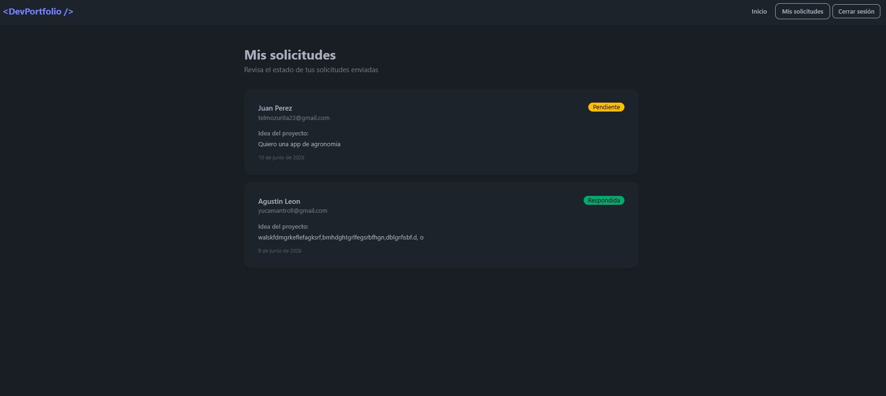

### Dashboard Programador
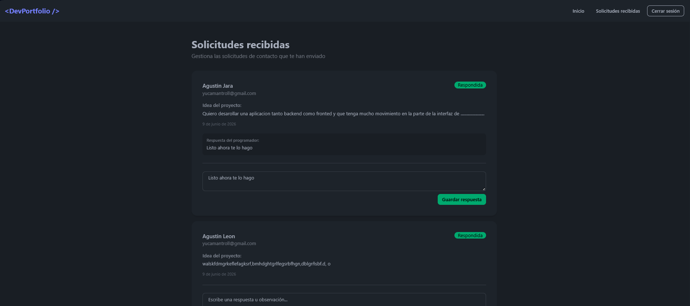

### Login y Registro
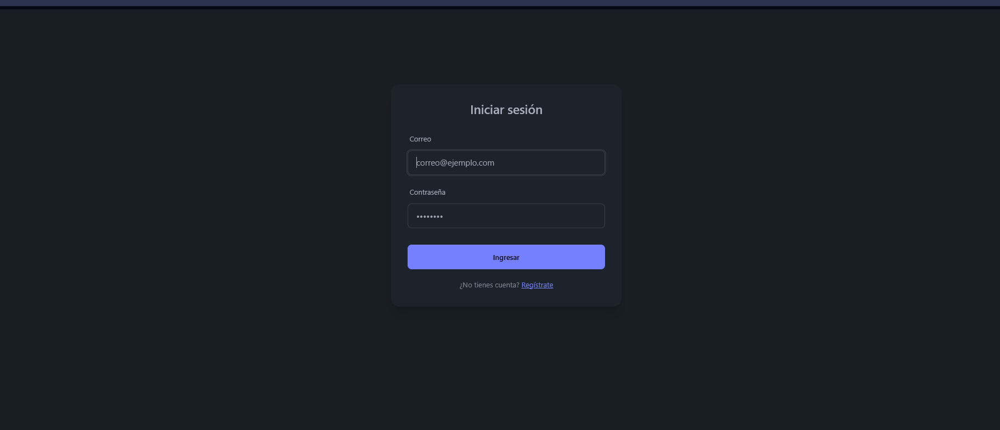

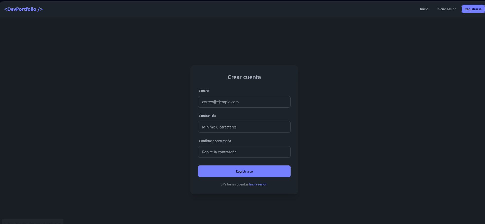

### Vista Móvil
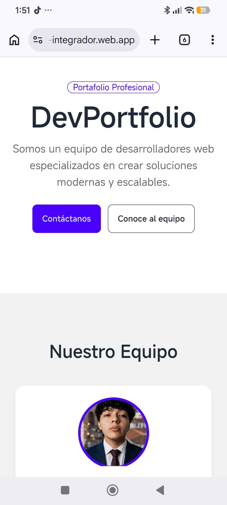

---

##  Stack Tecnológico

| Tecnología | Versión | Uso |
|---|---|---|
| Angular | 21.2.16 | Framework frontend |
| TailwindCSS | v4 | Estilos utilitarios |
| DaisyUI | v5 | Componentes UI |
| Firebase Auth | 20.0.1 | Autenticación |
| Cloud Firestore | 20.0.1 | Base de datos solicitudes |
| Strapi | v5 | CMS Headless |
| Firebase Hosting | — | Despliegue frontend |
| Strapi Cloud | — | Despliegue CMS |

---

##  Configuración y Despliegue Local

### Requisitos previos
- Node.js v24+
- pnpm v11+
- Angular CLI v21
- Cuenta de Firebase
- Cuenta de Strapi Cloud

### 1. Clonar repositorios

```bash
git clone https://github.com/Emanuelleon19/icc-ppw-integrador.git
git clone https://github.com/Emanuelleon19/icc-ppw-strapi.git
```

### 2. Configurar Angular

```bash
cd icc-ppw-integrador
pnpm install
```

Editamos `src/environments/environment.ts` con nuestras credenciales de Firebase y la URL de Strapi:

```ts
export const environment = {
  production: false,
  strapiUrl: 'http://localhost:1337/api',
  programmerEmails: ['correo1@gmail.com', 'correo2@gmail.com'],
  programmerSlugs: ['slug1', 'slug2'],
  firebase: {
    apiKey: 'TU_API_KEY',
    authDomain: 'TU_PROJECT.firebaseapp.com',
    projectId: 'TU_PROJECT_ID',
    storageBucket: 'TU_PROJECT.appspot.com',
    messagingSenderId: 'TU_SENDER_ID',
    appId: 'TU_APP_ID',
  },
};
```

```bash
ng serve
```

### 3. Configurar Strapi

```bash
cd icc-ppw-strapi
pnpm install
pnpm develop
```

Accedemos a `http://localhost:1337/admin` y configuramos los Content Types.

---

##  Despliegue Global

### Angular → Firebase Hosting

```bash
ng build
firebase deploy --only "hosting"
```

### Strapi → Strapi Cloud

1. Subir código a GitHub
2. Conectar repositorio en [cloud.strapi.io](https://cloud.strapi.io)
3. Actualizar `environment.prod.ts` con la URL de Strapi Cloud
4. Rebuild y redeploy de Angular

---

##  Guía de Usuario

### Usuario externo
1. Visita https://ppw-integrador.web.app
2. Explora el portafolio sin necesidad de cuenta
3. Para enviar una solicitud: regístrate en **Registrarse** o inicia sesión
4. Ve a **Contáctanos** y completa el formulario
5. Revisa el estado de tus solicitudes en **Mis solicitudes**

### Programador
1. Inicia sesión con tu cuenta de programador
2. Ve a **Solicitudes recibidas** en el navbar
3. Lee la idea del proyecto del solicitante
4. Escribe una respuesta en el textarea y clic en **Guardar respuesta**
5. El estado cambia automáticamente a **Respondida**

### Administrador de contenido (Strapi)
1. Accede a https://unwavering-rainbow-bcc8a36c7e.strapiapp.com/admin
2. Gestiona programadores, proyectos y servicios desde el Content Manager
3. Publica o despublica contenido según sea necesario

---

##  Estructura del Proyecto


### Angular
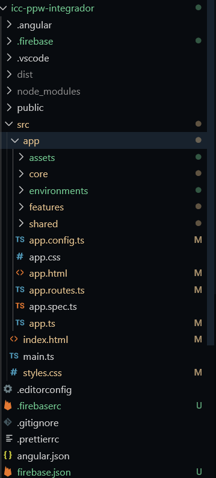

### Strapi

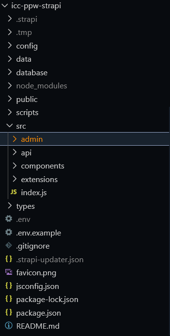

##  Decisiones de Diseño

- **Angular Standalone + Signals** — arquitectura moderna sin NgModules, estado reactivo sin RxJS complejo
- **TailwindCSS v4 + DaisyUI v5** — desarrollo rápido de UI responsive sin CSS personalizado
- **Lazy loading** — cada ruta carga su componente solo cuando se necesita, mejorando el tiempo de carga inicial
- **Guards funcionales** — protección de rutas basada en roles sin clases adicionales
- **Diferenciación por email** — los programadores se identifican por su correo en `environment.ts`, evitando un sistema de roles complejo en Firestore

---

##  Desafíos Encontrados

- **Aprendizaje de Angular Standalone** — la arquitectura sin NgModules es relativamente nueva, 
  requirió adaptarse a `provideRouter`, `provideFirebaseApp` y componentes standalone en lugar 
  del enfoque clásico con módulos

- **Integración de tres tecnologías simultáneas** — coordinar Angular, Firebase y Strapi 
  al mismo tiempo fue el mayor reto del proyecto, especialmente entender qué responsabilidad 
  le corresponde a cada capa

- **Signals de Angular** — el nuevo sistema de reactividad reemplaza patrones con RxJS que 
  eran más familiares, requirió entender `signal()`, `computed()` y `toSignal()`

- **Configuración de permisos en Strapi** — entender el sistema de roles y permisos públicos 
  de la API fue necesario para que Angular pudiera consumir los endpoints sin autenticación

- **Firestore vs base de datos relacional** — trabajar con una base de datos NoSQL orientada 
  a documentos fue diferente a lo aprendido en Fundamentos de Base de Datos, especialmente 
  en las consultas con `where` y la estructura de colecciones

